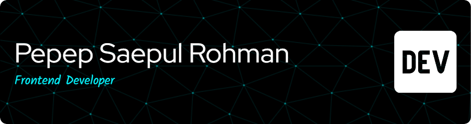

## Summary

Passionate and seasoned Software Engineer with a strong focus on frontend development. Proficient in TypeScript and well-versed in all aspects of web technologies. Collaborative team player dedicated to delivering efficient, scalable, and visually appealing web applications.

---

## Skils

  
  
  
  
  
  
  
  
  
  
  
  
  
  
  
  

###

###
